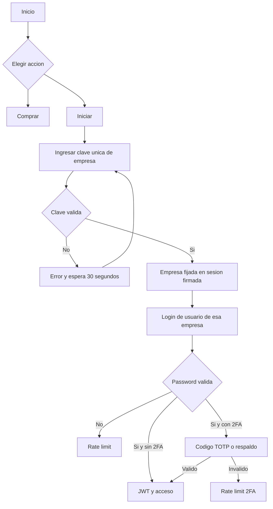

# Análisis de seguridad OWASP y cambios aplicados

**Fecha:** 2026-09-04

## Resumen

Se aplicó una primera capa de endurecimiento al sistema CreditosPro sin cambiar la paleta de colores ni las animaciones principales.

## Cambios aplicados

### A01 - Control de acceso roto

- El login ya no confía en `empresa_id` enviado por el navegador.
- La empresa se fija en una sesión firmada después de validar la clave comercial.
- La clave de empresa es única y compartida entre sus dispositivos.
- El router de equipos exige rol `superadmin`.
- Se eliminó el doble prefijo de las rutas de equipos.
- PWA filtra clientes, préstamos y cuotas por zonas autorizadas.
- Reportes filtran por las zonas autorizadas del usuario.

### A02 - Fallos criptográficos

- Contraseñas: bcrypt con hash adaptativo. No se encriptan antes de hashearse; para contraseñas se almacena únicamente un hash no reversible.
- Claves comerciales: SHA-256 determinista para búsqueda y comparación constante; nunca se guarda la clave original.
- Secreto TOTP: cifrado con Fernet derivado de `SECRET_KEY`.
- Códigos de respaldo 2FA: solo se guardan sus hashes.
- Cookies de sesión: HttpOnly, SameSite Strict y Secure en producción.
- JWT: PyJWT con algoritmo explícito HS256; se retiró `python-jose` para eliminar su dependencia transitiva `ecdsa` vulnerable.

### A03 - Inyección

- Las consultas de negocio usan SQLAlchemy ORM y parámetros.
- La validación existente evita interpolación de entradas en consultas de negocio.
- El SQL dinámico de scripts operativos debe ejecutarse únicamente con nombres de tablas definidos por constantes internas.
- No se encontraron `eval`, `exec`, `pickle`, `shell=True` ni `verify=False` en la superficie revisada.

### A04 - Diseño inseguro

- Activación de empresa antes del login de usuario.
- Bloqueo de 30 segundos tras clave de activación incorrecta.
- Desafío TOTP separado antes de emitir el JWT.
- Sesión pendiente de 2FA limitada a cinco minutos.
- Códigos de respaldo de un solo uso.

### A05 - Configuración insegura

- Se activaron `SecurityHeadersMiddleware` y `BodySizeLimitMiddleware`.
- Se activó `RequestIDMiddleware` para correlacionar eventos.
- CORS sigue usando una lista explícita de orígenes.
- Se eliminó la confianza automática en `X-Forwarded-For` para rate limiting.
- La configuración sensible continúa dependiendo de variables de entorno.

### A07 - Fallos de autenticación

- Login limitado por IP a diez intentos por minuto.
- Activación con rate limit general más bloqueo específico de 30 segundos.
- Passwords sin valores fijos en código.
- 2FA TOTP disponible para usuarios que lo configuren.
- Se corrigió el error de expiración en listado de sesiones.

### A08 - Fallos de integridad de software y datos

- La clave de empresa se genera con nombre normalizado y entropía aleatoria.
- La base guarda hash y referencia parcial, no la clave.
- Se añadió migración Alembic para activación y 2FA.
- Existe comando administrativo `crear_clave_empresa.py`.

### A09 - Fallos de logging y monitorización

- Se mantiene auditoría específica para login, logout, cambio de contraseña, recuperación, 2FA y sesiones.
- Se añadió auditoría transversal de operaciones mutables con usuario, empresa, IP, ruta, estado y timestamp.
- Se activa `X-Request-ID` para correlacionar peticiones y logs.

### A10 - SSRF

- La única llamada externa principal revisada es CallMeBot con URL fija y timeout.
- No se detectó URL arbitraria controlada por el usuario en esa llamada.

## Nuevo flujo de acceso



## Archivos principales nuevos o modificados

- `app/utils/company_activation.py`
- `app/utils/two_factor.py`
- `app/utils/audit_middleware.py`
- `crear_clave_empresa.py`
- `alembic/versions/20260904_0003_activation_and_2fa.py`
- `app/routers/license_router.py`
- `app/routers/auth.py`
- `app/routers/equipos_router.py`
- `app/routers/pwa.py`
- `app/routers/prestamos.py`
- `app/routers/reportes.py`
- `app/services/excel_service.py`
- `app/main.py`
- `templates/inicio.html`
- `templates/activacion.html`
- `templates/auth/2fa.html`

## Comandos operativos

### Migrar la base de datos

```powershell
.\.venv\Scripts\python.exe -m alembic upgrade head
```

Debe ejecutarse con `DATABASE_URL` apuntando a la base correcta y con un backup aprobado.

### Crear clave de empresa

```powershell
.\.venv\Scripts\python.exe crear_clave_empresa.py --empresa-id 1
```

Para invalidar la anterior y crear otra:

```powershell
.\.venv\Scripts\python.exe crear_clave_empresa.py --empresa-id 1 --rotar
```

La clave solo se imprime al crearla. El sistema guarda únicamente su hash.

## RLS de PostgreSQL

El sistema ya aplica aislamiento por empresa y zona en los routers y servicios principales. Eso es aislamiento de aplicación, no RLS nativo de PostgreSQL.

RLS nativo debe desplegarse con:

1. Un rol de aplicación que no sea propietario de las tablas.
2. `ALTER TABLE ... ENABLE ROW LEVEL SECURITY`.
3. Políticas que usen `current_setting('app.empresa_id', true)`.
4. Contexto `SET LOCAL` al inicio de cada transacción autenticada.
5. Excepciones controladas para activación, scheduler y migraciones.
6. Pruebas de dos empresas y dos zonas.

No se habilita automáticamente en esta fase porque activar RLS sobre el rol propietario sin configurar el contexto rompería activación, scheduler y tareas de mantenimiento. La ausencia de RLS nativo debe tratarse como una tarea de despliegue pendiente, no como un control ya completado.

### Estado de la conexión de ejemplo

La conexión actual usa el rol `postgres` con `BYPASSRLS=true`. Por eso no se activaron las políticas sobre esta conexión: ese rol puede saltarse RLS y no sirve para probar aislamiento real. Se requiere un rol de aplicación separado con `BYPASSRLS=false`.

La aplicación ya soporta el contexto optativo mediante `ENABLE_DATABASE_RLS=0|1` y establece `app.empresa_id` desde el JWT validado, comprobando también `Usuario.empresa_id`.

## Revisión de secretos

- `.env` no está versionado actualmente.
- Deben rotarse las credenciales que fueron expuestas durante el trabajo.
- `DATABASE_URL`, `SECRET_KEY`, `SESSION_SECRET_KEY` y `LICENSE_MASTER_KEY` deben existir solo en el gestor de secretos del entorno.
- `INITIAL_ADMIN_PASSWORD` es obligatoria para seed o normalización inicial y no tiene valor por defecto.
- No se deben guardar contraseñas en scripts, documentación, logs ni repositorios.

## Validaciones ejecutadas

- Compilación de los módulos modificados: correcta.
- Generación de secreto TOTP: correcta.
- Generación de códigos de respaldo: correcta.
- Generación de clave de empresa: correcta.
- Pruebas de seguridad, XSS, licencias y arranque: 18 pasaron.
- Integración aislada de login/logout/cambio de contraseña: correcta.
- `pip-audit -r requirements.txt`: sin vulnerabilidades conocidas.

## Pendientes prioritarios

1. Ejecutar la migración Alembic en cada entorno con backup aprobado.
2. Generar la clave de cada empresa existente con el comando administrativo.
3. Configurar `superadmin` para operar el router de equipos.
4. Corregir el contrato JSON/formulario de sincronización de cobros PWA.
5. Retirar el montaje público de `/uploads` y servir fotos solo con autorización.
6. Añadir tests negativos de empresa, rol y zona.
7. Añadir `pip-audit` o equivalente al pipeline CI.
8. Diseñar y desplegar RLS nativo con rol de aplicación separado.
9. Prevenir formula injection en exportaciones Excel/CSV.
10. Cambiar el scheduler por una tarea distribuida si se despliegan varias réplicas.
