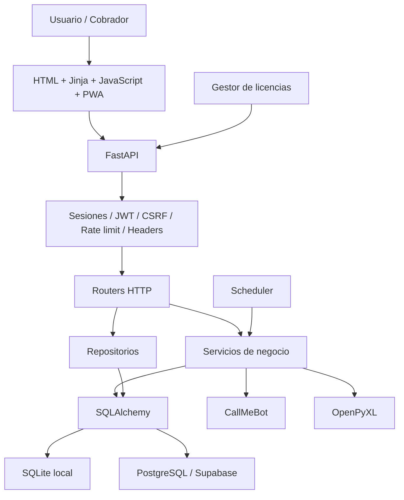
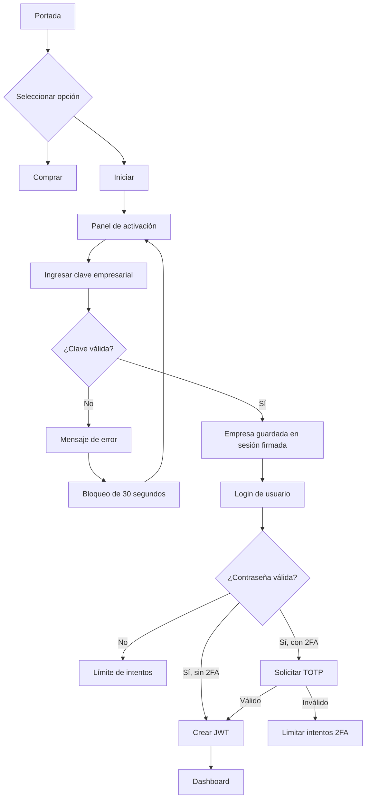

# CreditosPro
## Informe técnico, funcional y de seguridad

**Fecha:** 4 de septiembre de 2026  
**Sistema:** CreditosPro  
**Propósito:** Gestión de empresas, clientes, créditos, cuotas, cobros, cobradores y reportes

---

## 1. Presentación del software

CreditosPro es una plataforma web para administrar operaciones de crédito y cobranza. Está diseñada para trabajar con varias empresas independientes, manteniendo sus datos separados mediante `empresa_id`, usuarios, roles y zonas operativas.

El sistema permite:

- Administrar empresas.
- Crear usuarios administrativos, supervisores y cobradores.
- Organizar la operación por zonas.
- Registrar clientes y codeudores.
- Crear préstamos.
- Calcular intereses y cuotas.
- Registrar cobros.
- Controlar cuotas vencidas y cartera.
- Generar reportes Excel.
- Enviar recordatorios por WhatsApp.
- Trabajar parcialmente sin conexión mediante PWA.
- Activar el software mediante una clave única por empresa.
- Registrar auditoría de operaciones.
- Utilizar autenticación de doble factor.

El backend es responsable de validar todos los datos. El frontend solo presenta la interfaz: nunca se considera una fuente confiable de permisos, empresa, rol o montos.

---

## 2. Arquitectura general



El sistema es un monolito modular: backend, frontend, APIs y servicios se ejecutan dentro de la misma aplicación FastAPI, pero están separados por responsabilidades.

---

## 3. Lenguajes y frameworks utilizados

### Backend

- **Python 3.11 o superior:** lenguaje principal.
- **FastAPI:** framework HTTP y APIs.
- **Uvicorn:** servidor ASGI.
- **SQLAlchemy:** ORM y acceso a base de datos.
- **Alembic:** migraciones de estructura.
- **Pydantic:** validación de datos.
- **Jinja2:** renderizado de páginas HTML.
- **python-multipart:** formularios y archivos.

### Seguridad

- **bcrypt:** hash de contraseñas.
- **PyJWT:** tokens JWT con HS256.
- **cryptography/Fernet:** cifrado de secretos como TOTP.
- **PyOTP:** códigos de autenticación de doble factor.
- **secrets:** generación criptográficamente segura de claves y tokens.
- **hashlib/HMAC:** hashes y comparación constante.
- **pip-audit:** auditoría de vulnerabilidades de dependencias.

### Datos y archivos

- **SQLite:** desarrollo y uso local.
- **PostgreSQL/Supabase:** producción.
- **Pillow:** validación y reprocesamiento de imágenes.
- **OpenPyXL:** generación de reportes Excel.
- **CSV estándar de Python:** exportaciones estructuradas.

### Frontend

- HTML.
- CSS.
- JavaScript vanilla.
- Fetch API.
- IndexedDB/Dexie.
- Service Worker.
- Web App Manifest.
- Anime.js para animaciones visuales existentes.

---

## 4. Componentes principales del backend

### `app/main.py`

Es el punto de entrada de la aplicación. Se encarga de:

- Crear la instancia FastAPI.
- Cargar variables de entorno.
- Iniciar la base de datos.
- Verificar licencia.
- Iniciar el scheduler.
- Registrar middlewares.
- Registrar routers.
- Servir recursos estáticos.
- Exponer `/health`.

### `app/database.py`

Contiene:

- Engine SQLAlchemy.
- `SessionLocal`.
- Modelos de base de datos.
- Relaciones y claves foráneas.
- Restricciones financieras.
- Contexto opcional para RLS.

### `app/routers/`

Contiene las APIs y páginas de:

- Autenticación.
- Clientes.
- Préstamos.
- Cobros.
- Zonas.
- Reportes.
- WhatsApp.
- Licencias.
- Equipos.
- PWA.
- Registro y selección de empresa.

### `app/services/`

Contiene lógica que no debe estar mezclada con las rutas:

- `prestamo_service.py`: cálculo de préstamos y estados.
- `whatsapp_service.py`: envío y registro de notificaciones.
- `excel_service.py`: reportes Excel.
- `scheduler.py`: tareas automáticas.

### `app/utils/`

Contiene controles compartidos:

- Seguridad y JWT.
- Activación empresarial.
- 2FA.
- CSRF.
- Rate limiting.
- Headers de seguridad.
- Límite de tamaño de solicitudes.
- Auditoría.
- Permisos de zona.
- Validadores.
- Licencias.
- Lista de tokens revocados.

---

## 5. Flujo completo de entrada al software



### Paso 1: portada

La portada conserva la paleta y animaciones existentes. Muestra:

- **Iniciar:** lleva al panel de activación.
- **Comprar:** lleva al destino configurado mediante `PURCHASE_URL`.

### Paso 2: activación empresarial

El usuario ingresa una clave única de empresa.

El backend:

1. Normaliza la clave.
2. Valida formato.
3. Comprueba rate limit.
4. Calcula SHA-256 de la clave recibida.
5. Busca coincidencia con `activation_key_hash`.
6. Comprueba que la empresa esté activa.
7. Guarda `activated_empresa_id` en la sesión firmada.
8. Redirige al login de esa empresa.

Una clave incorrecta produce:

- HTTP 401 en el primer fallo.
- Bloqueo temporal de 30 segundos.
- HTTP 429 durante el bloqueo.

### Paso 3: login

El usuario escribe username y contraseña.

El backend:

1. Ignora cualquier empresa enviada por el navegador.
2. Obtiene la empresa desde la sesión de activación.
3. Busca el usuario activo dentro de esa empresa.
4. Verifica el hash bcrypt.
5. Si no existe el usuario, ejecuta un hash dummy para evitar ataques de timing.
6. Si hay 2FA, detiene el proceso y solicita TOTP.
7. Si todo es válido, genera JWT.
8. Emite cookies de sesión y CSRF.
9. Registra el acceso en auditoría.

---

## 6. Cómo se crea la clave de empresa

La clave se genera mediante:

```powershell
.\.venv\Scripts\python.exe crear_clave_empresa.py --empresa-id 1
```

Para rotar una clave existente:

```powershell
.\.venv\Scripts\python.exe crear_clave_empresa.py --empresa-id 1 --rotar
```

El proceso:

1. Busca la empresa por ID.
2. Comprueba si ya tiene una clave.
3. Si existe, exige `--rotar` para evitar reemplazos accidentales.
4. Genera un prefijo legible con el nombre de la empresa.
5. Añade entropía aleatoria criptográficamente segura.
6. Normaliza la clave a mayúsculas.
7. Calcula SHA-256.
8. Guarda únicamente el hash.
9. Guarda una referencia parcial, por ejemplo `...AB12CD34`.
10. Muestra la clave completa una sola vez para entregarla al administrador.

La clave tiene una estructura conceptual como:

```text
NOMBRE-EMPRESA-COMPONENTE-ALEATORIO
```

La clave no depende de un dispositivo. Es una clave comercial única para la empresa y puede utilizarse en sus dispositivos autorizados.

---

## 7. Dónde se almacena la clave empresarial

La clave completa **no se almacena** en la base de datos.

En la tabla `empresas` se guardan:

- `activation_key_hash`: hash SHA-256 de la clave.
- `activation_key_hint`: últimos caracteres para identificación administrativa.
- `activation_enabled`: indica si la activación está habilitada.

La comparación se realiza así:

```text
clave recibida
    -> normalización
    -> SHA-256
    -> comparación contra activation_key_hash
```

La comparación utiliza comparación constante para reducir riesgos de timing.

La clave completa solo debe existir en:

- El momento de generación.
- La entrega segura al administrador.
- El dispositivo donde el usuario la introduzca temporalmente.

No debe guardarse en:

- Código fuente.
- `.env` del cliente.
- Logs.
- Auditoría.
- Respuestas posteriores de la API.
- Repositorios Git.
- Documentación pública.

---

## 8. Contraseñas de usuarios

Las contraseñas de usuarios se protegen con bcrypt.

Proceso:

```text
Contraseña original
    -> bcrypt con salt
    -> password_hash
    -> base de datos
```

Para contraseñas no se necesita cifrado reversible. Una contraseña debe almacenarse como hash porque el sistema nunca necesita recuperar el texto original.

Cuando se necesita guardar un secreto que sí debe recuperarse, como un secreto TOTP, se utiliza cifrado Fernet.

Se eliminaron las contraseñas fijas de desarrollo como `Admin123`. Ahora la contraseña inicial debe llegar desde:

```dotenv
INITIAL_ADMIN_PASSWORD=...
```

La variable no debe quedar escrita en código ni en documentación.

---

## 9. Autenticación de doble factor

El 2FA utiliza TOTP compatible con Google Authenticator y Authy.

Flujo:

1. El usuario autenticado solicita configuración.
2. El sistema genera un secreto base32.
3. El secreto se cifra con Fernet usando material derivado de `SECRET_KEY`.
4. Se genera una URI `otpauth://`.
5. El usuario escanea la URI.
6. Confirma un código TOTP.
7. El sistema activa 2FA.
8. Se generan códigos de respaldo.
9. Solo se guardan hashes de los códigos.
10. Cada código de respaldo se elimina después de usarse.

El JWT no se emite hasta completar el desafío 2FA.

---

## 10. Roles y permisos

Roles disponibles:

- `admin`.
- `superadmin`.
- `supervisor`.
- `cobrador`.

### Administradores

Pueden gestionar la empresa, usuarios, zonas y configuración según su nivel.

### Supervisores y cobradores

Su acceso se limita mediante zonas asignadas.

El backend comprueba siempre:

- Usuario autenticado.
- Usuario activo.
- Empresa del usuario.
- Zona solicitada.
- Rol requerido.

El frontend puede ser manipulado; por eso ocultar un botón no constituye seguridad.

---

## 11. Multiempresa y aislamiento

Todas las entidades principales tienen `empresa_id`:

- Usuarios.
- Zonas.
- Clientes.
- Préstamos.
- Cuotas.
- Cobros.
- Notificaciones.
- Configuración.
- Auditoría.
- Licencias.

El aislamiento se aplica en dos niveles:

### Nivel 1: aplicación

Las consultas filtran por `empresa_id` y zona autorizada.

### Nivel 2: PostgreSQL RLS

Está preparado en [rls_policies.sql](rls_policies.sql), pero requiere un rol PostgreSQL sin `BYPASSRLS`.

La aplicación ya tiene contexto optativo:

```dotenv
ENABLE_DATABASE_RLS=0
```

Cuando se pruebe con un rol adecuado:

```dotenv
ENABLE_DATABASE_RLS=1
```

La conexión de ejemplo actualmente usa un rol con `BYPASSRLS=true`, por lo que no sirve para probar RLS real.

---

## 12. Préstamos y cuotas

El servicio financiero utiliza `Decimal` y redondeo monetario.

Cálculo:

```text
interés = capital × tasa / 100
total = capital + interés
cuota = total / número de cuotas
```

La última cuota absorbe diferencias de redondeo.

El sistema controla:

- Capital positivo.
- Tasa dentro del rango.
- Número válido de cuotas.
- Estados permitidos.
- Valor de cuota positivo.
- Pago no negativo.
- Pago no superior al valor de la cuota.

---

## 13. Cobros y concurrencia

El registro de cobro utiliza una actualización condicional.

Si dos personas intentan cobrar la misma cuota al mismo tiempo:

1. Ambas leen el saldo.
2. La primera actualización modifica la fila.
3. La segunda ya no encuentra el valor anterior.
4. La segunda recibe conflicto `409`.
5. No se sobrescribe el primer cobro.

También se verifica:

- Empresa.
- Préstamo relacionado.
- Cliente relacionado.
- Zona.
- Saldo restante.
- Coordenadas.
- Monto.

---

## 14. Auditoría

El sistema registra acciones sensibles como:

- Login.
- Logout.
- Cambio de contraseña.
- Recuperación de contraseña.
- Activación de 2FA.
- Revocación de sesión.
- Creación y modificación de usuarios.
- Operaciones mutables generales.

Los registros incluyen:

- Empresa.
- Usuario.
- Username.
- Acción.
- Categoría.
- IP.
- Ruta.
- Estado HTTP.
- Fecha y hora.

Además, cada solicitud tiene `X-Request-ID` para relacionar logs y auditoría.

No se deben guardar contraseñas, claves completas ni tokens completos en auditoría.

---

## 15. PWA y trabajo offline

La PWA utiliza:

- IndexedDB.
- Dexie cuando está disponible.
- Service Worker.
- Cache de recursos.
- Cola local de cobros pendientes.

La sincronización:

1. Descarga datos autorizados.
2. Guarda cobros offline.
3. Espera conexión.
4. Envía cobros como formulario compatible con FastAPI.
5. Incluye CSRF.
6. Marca el cobro como sincronizado solo después de respuesta exitosa.

El backend vuelve a comprobar empresa, usuario, zona, cuota y monto.

---

## 16. WhatsApp

El servicio utiliza `httpx` para comunicarse con CallMeBot.

Puede usar:

- Configuración global de empresa.
- Configuración por zona.
- Mensajes de vencimiento.
- Recordatorios.
- Envío manual.
- Historial de notificaciones.

Las credenciales de WhatsApp deben mantenerse fuera del código y gestionarse como secretos del entorno o cifrarse cuando se almacenan en la base.

---

## 17. Backups

Se dispone de dos herramientas:

### Backup manual

```powershell
.\.venv\Scripts\python.exe backup_supabase.py
```

Genera:

- JSON por tabla.
- CSV por tabla.
- Manifest.
- Conteos.
- Hash SHA-256 por archivo.
- Estado `verified`.

### Backup programado

```powershell
.\.venv\Scripts\python.exe backup_supabase_cron.py --retention-days 30
```

El cron:

1. Ejecuta el backup.
2. Comprueba el manifiesto.
3. Rechaza backups no verificados.
4. Comprime con `tarfile` compatible con Windows.
5. Puede subir a S3/R2.
6. Elimina backups antiguos.

Backup de ejemplo generado recientemente:

```text
backups\backup_20260904_202150
```

---

## 18. Seguridad OWASP aplicada

### A01 - Control de acceso

- Sesiones JWT.
- Validación de empresa en backend.
- Roles.
- Zonas.
- Router de equipos reservado a `superadmin`.
- Filtros PWA y reportes.
- Preparación RLS.

### A02 - Fallos criptográficos

- Bcrypt.
- PyJWT.
- Fernet.
- TOTP.
- SHA-256 para claves empresariales.
- Códigos de respaldo hasheados.
- Secretos por variables de entorno.

### A03 - Inyección

- SQLAlchemy ORM.
- Validación de inputs.
- SQL dinámico limitado a scripts operativos con constantes.
- Sin `eval`, `exec`, `pickle` ni `shell=True` en la superficie revisada.

### A04 - Diseño inseguro

- Activación previa al login.
- Bloqueo de 30 segundos.
- 2FA.
- Rate limit.
- Validación server-side.

### A05 - Configuración insegura

- Headers de seguridad.
- Límite de body.
- CORS explícito.
- Request ID.
- Sin publicación pública de fotografías.

### A07 - Autenticación

- Rate limit de login.
- Hash dummy.
- JWT expirables.
- Revocación de tokens.
- 2FA.

### A09 - Logging

- Audit log.
- IP.
- Usuario.
- Empresa.
- Endpoint.
- Timestamp.
- Request ID.

---

## 19. Herramientas de verificación utilizadas

- `pytest`: pruebas automatizadas.
- `pip-audit`: vulnerabilidades de dependencias.
- `py_compile`: sintaxis Python.
- `compileall`: compilación de aplicación.
- Diagnósticos del editor/Pylance.
- SQLAlchemy URL parser.
- Alembic `upgrade head` y `current`.
- Smoke test HTTP local con `httpx`.
- Validación de manifiestos de backup.
- `git diff --check`.

Resultados principales:

- `pip-audit`: sin vulnerabilidades conocidas.
- Pruebas de seguridad e integración: 27 pasaron.
- Prueba local HTTP: activación, login, dashboard y rate limit correctos.
- Migración actual: `20260904_0003`.

---

## 20. Qué se mejoró

- Se incorporó activación por empresa.
- Se eliminó la dependencia de activación por dispositivo para el flujo comercial.
- Se eliminó la confianza en `empresa_id` del frontend.
- Se implementó 2FA real.
- Se retiraron contraseñas fijas del código.
- Se protegió la descarga de fotos.
- Se corrigió la sincronización PWA.
- Se endurecieron exports Excel/CSV.
- Se protegió la API de equipos.
- Se añadieron auditoría y request ID.
- Se activaron headers de seguridad y límite de solicitudes.
- Se actualizaron dependencias vulnerables.
- Se reemplazó `python-jose` por PyJWT.
- Se preparó el contexto RLS.
- Se mejoró el sistema de backups.

## 21. Qué se eliminó o retiró

- Publicación estática pública de `/uploads`.
- Doble prefijo `/equipos/equipos`.
- Contraseña fija `Admin123` del seed.
- Contraseña fija de normalización.
- Dependencia `python-jose` y su dependencia indirecta `ecdsa`.
- Envío JSON incompatible para sincronización de cobros PWA.
- Confianza directa en `X-Forwarded-For` para identificar clientes.
- Devolución de errores internos detallados en las áreas corregidas.
- Concatenación manual insegura de CSV.

---

## 22. Estado actual

| Área | Estado |
|---|---|
| Backend FastAPI | Implementado |
| Base PostgreSQL/Supabase | Conectada y migrada |
| SQLite local | Disponible |
| Activación empresarial | Implementada |
| Clave empresarial ElRusso | Generada y almacenada como hash |
| Login por empresa | Implementado |
| Rate limit | Implementado |
| 2FA | Implementado |
| Auditoría | Implementada |
| Backups verificados | Implementados |
| PWA | Implementada y corregida |
| Dependencias | Auditadas con pip-audit |
| RLS | Contexto integrado, políticas pendientes de activar con rol adecuado |
| Pruebas | 27 pruebas relevantes aprobadas |

---

## 23. Operación recomendada

### Ejecutar localmente

```powershell
.\.venv\Scripts\Activate.ps1
$env:DATABASE_URL = "sqlite:///./creditospro_dev.db"
$env:ENABLE_DATABASE_RLS = "0"
.\.venv\Scripts\python.exe -m uvicorn app.main:app --host 127.0.0.1 --port 8000
```

### Consultar migración

```powershell
.\.venv\Scripts\python.exe -m alembic current
```

### Generar clave empresarial

```powershell
.\.venv\Scripts\python.exe crear_clave_empresa.py --empresa-id 1
```

### Ejecutar pruebas

```powershell
.\.venv\Scripts\python.exe -m pytest -q
```

### Auditar dependencias

```powershell
.\.venv\Scripts\python.exe -m pip_audit -r requirements.txt
```

---

## 24. Pendientes de producción

Antes de poner el sistema en operación real:

1. Rotar las credenciales que fueron expuestas durante el desarrollo.
2. Crear un rol PostgreSQL con `BYPASSRLS=false`.
3. Probar y activar RLS en staging.
4. Verificar restauración real de backups.
5. Programar backups automáticos y alertas.
6. Configurar un gestor de secretos.
7. Añadir pruebas de aislamiento entre empresas.
8. Revisar retención de auditoría.
9. Configurar monitorización y alertas.
10. No usar el rol `postgres` para el backend.

---

## Conclusión

CreditosPro es una plataforma de gestión de créditos con backend FastAPI, persistencia SQLAlchemy, soporte PostgreSQL/Supabase y SQLite, frontend Jinja/JavaScript, operación PWA y módulos de seguridad empresarial.

El software valida los permisos en backend, separa empresas, controla zonas, registra auditoría, protege contraseñas con bcrypt, utiliza 2FA, limita intentos, protege archivos, genera backups verificados y tiene preparada la integración con RLS.

La clave empresarial se crea una vez por empresa, puede utilizarse en varios dispositivos autorizados y nunca se almacena en texto claro. Solo se guarda su hash SHA-256 y una referencia parcial.

El sistema está listo para seguir pruebas locales y staging. La activación de RLS en producción debe hacerse únicamente después de utilizar un rol de base de datos sin `BYPASSRLS` y comprobar el aislamiento entre empresas.
