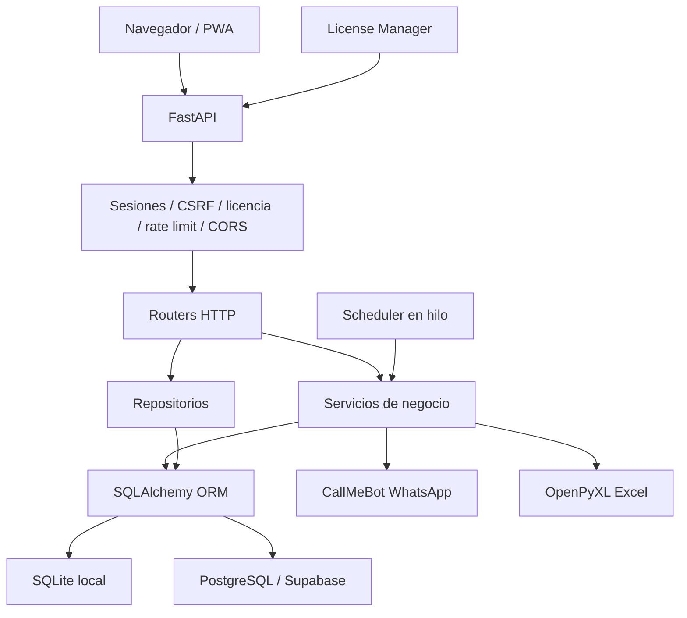
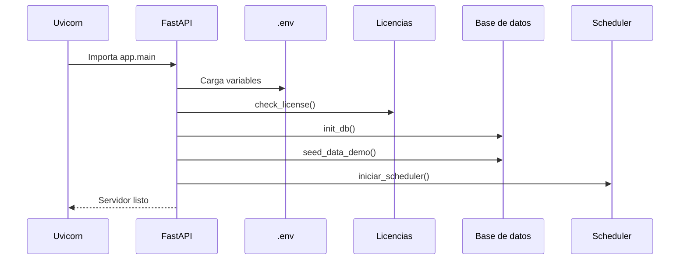
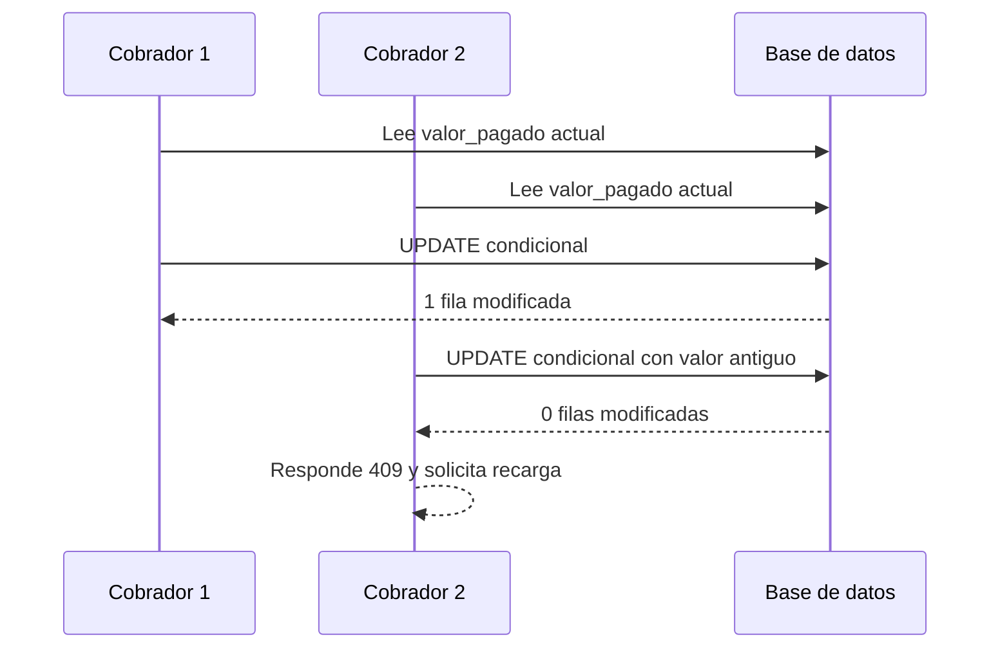
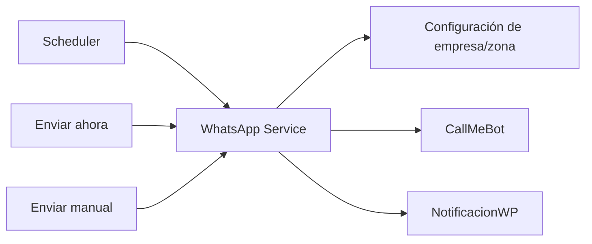

# CreditosPro - Resumen técnico completo

**Fecha de revisión:** 2026-09-04  
**Tipo de sistema:** Gestión de créditos, clientes, préstamos, cuotas, cobros y cobradores  
**Estado:** Aplicación web con soporte local, PostgreSQL/Supabase, PWA y licenciamiento por equipo

> Este documento describe el software que existe actualmente en el repositorio. Incluye arquitectura, tecnologías, módulos, APIs, flujos, datos, seguridad, despliegue, pruebas y pendientes técnicos.

## 1. Resumen ejecutivo

CreditosPro es una aplicación web monolítica construida con Python y FastAPI. Sirve simultáneamente el backend, las páginas HTML, los recursos estáticos y las APIs. Usa SQLAlchemy para acceder a SQLite en desarrollo o PostgreSQL/Supabase en producción.

Las funciones principales son:

- Administración de empresas.
- Usuarios y roles.
- Asignación de cobradores a zonas.
- Registro de clientes y codeudores.
- Fotografías de clientes.
- Creación de préstamos.
- Cálculo de intereses y cuotas.
- Registro de pagos y cobros.
- Control de cuotas vencidas y cartera.
- Reportes Excel.
- Recordatorios por WhatsApp mediante CallMeBot.
- Funcionamiento PWA y modo offline.
- Licencias activadas por máquina.
- Registro y administración de equipos.

El núcleo financiero está razonablemente estructurado, especialmente el cálculo monetario y el registro atómico de cobros. Los principales riesgos actuales están en la API de equipos, la publicación de archivos, la autorización por zona de reportes/PWA y algunos controles de seguridad que están implementados en código pero no se registran en la aplicación.

## 2. Tecnologías

### Backend

- Python 3.11 o superior.
- FastAPI 0.115.x.
- Uvicorn.
- SQLAlchemy 2.x.
- Alembic.
- Pydantic 2.x.
- Jinja2.
- python-multipart.
- bcrypt.
- python-jose para JWT.
- cryptography/Fernet para licencias.
- httpx para llamadas externas.
- Pillow para procesamiento de imágenes.
- OpenPyXL para reportes Excel.

### Frontend

- HTML y plantillas Jinja2.
- CSS.
- JavaScript vanilla.
- Fetch API.
- IndexedDB/Dexie para datos offline.
- Service Worker.
- Web App Manifest.

### Persistencia

- SQLite para desarrollo y uso local.
- PostgreSQL para producción y Supabase.
- SQLAlchemy ORM.
- Alembic para migraciones.

### Despliegue

- Docker.
- Railway mediante `Procfile`, `nixpacks.toml` o `start.sh`.
- Contenedor ejecutado con usuario Linux no root.
- Uvicorn con un worker.

## 3. Arquitectura



La aplicación es principalmente monolítica: los routers, servicios, configuración, autorización y acceso a datos se ejecutan dentro del mismo proceso Python.

## 4. Punto de entrada

El archivo principal es `app/main.py`.

Responsabilidades:

1. Cargar `.env`.
2. Importar FastAPI y los routers.
3. Comprobar la licencia al iniciar.
4. Validar variables obligatorias.
5. Inicializar las tablas si `AUTO_CREATE_TABLES` está habilitado.
6. Cargar datos demo si corresponde.
7. Iniciar el scheduler.
8. Configurar middleware.
9. Montar `/static` y `/uploads`.
10. Registrar todas las rutas.
11. Exponer `/health`.

Arranque de producción:

```bash
sh start.sh
```

Contenido actual de `start.sh`:

```bash
PORT=${PORT:-8000}
exec uvicorn app.main:app --host 0.0.0.0 --port "$PORT" --workers 1
```

## 5. Flujo de inicio



## 6. Estructura del proyecto

### Aplicación

- `app/main.py`: creación de FastAPI, middlewares, routers y arranque.
- `app/database.py`: engine, sesiones, modelos y relaciones SQLAlchemy.
- `app/routers/`: endpoints web y APIs.
- `app/services/`: lógica de préstamos, WhatsApp, scheduler y Excel.
- `app/repositories/`: acceso encapsulado a datos, actualmente usuario.
- `app/schemas/`: modelos Pydantic.
- `app/utils/`: seguridad, roles, validadores, CSRF, licencia, rate limiting y utilidades.

### Frontend

- `templates/`: páginas HTML y formularios.
- `templates/auth/`: login, recuperación y usuarios.
- `static/css/`: estilos.
- `static/js/`: PWA y animaciones.
- `static/sw.js`: Service Worker.
- `static/manifest.json`: instalación como aplicación.

### Datos y operación

- `alembic/`: configuración de migraciones.
- `backups/`: copias locales.
- `uploads/fotos/`: fotografías.
- `licencias/`: registros y documentación de equipos.
- `tests/`: pruebas automatizadas.

## 7. Routers y APIs

### Autenticación: `/auth`

- `GET /auth/login`: página de login.
- `POST /auth/login`: valida usuario y crea sesión JWT.
- `GET|POST /auth/logout`: revoca sesión y borra cookies.
- `GET /auth/usuarios`: lista usuarios de la empresa.
- `POST /auth/usuarios/nuevo`: crea usuario.
- `POST /auth/usuarios/{id}/editar`: modifica usuario.
- `DELETE /auth/usuarios/{id}`: desactiva usuario.
- `POST /auth/cambiar-password`: cambia contraseña.
- `POST /auth/recovery/request`: solicita recuperación.
- `POST /auth/recovery/reset`: restablece contraseña.
- `GET /auth/sesiones`: lista sesiones activas.
- `POST /auth/sesiones/{jti}/revocar`: revoca una sesión.

### Empresas y registro

- `GET /seleccionar-empresa`: selector de empresa.
- `GET|POST /registro`: registro público si está habilitado.

### Clientes: `/clientes`

- `GET /clientes`: vista principal.
- `GET /clientes/buscar-ajax`: búsqueda paginada.
- `GET /clientes/sync`: datos para PWA.
- `POST /clientes/nuevo`: crea cliente.
- `POST /clientes/{id}/editar`: modifica cliente.
- `GET /clientes/{id}`: detalle de cliente.

### Préstamos: `/prestamos`

- `GET /prestamos`: vista principal.
- `GET /prestamos/buscar-ajax`: búsqueda paginada.
- `GET /prestamos/calcular`: previsualiza cálculo.
- `POST /prestamos/nuevo`: crea préstamo y cuotas.
- `GET /prestamos/sync`: préstamos offline.
- `GET /prestamos/sync/cuotas`: cuotas offline.

### Cobros: `/cobros`

- `GET /cobros`: pantalla de cobros.
- `GET /cobros/buscar-ajax`: historial de cobros.
- `GET /cobros/pendientes-ajax`: cuotas pendientes.
- `POST /cobros/registrar`: registra cobro.
- `POST /cobros/registrar-cliente/{id}`: cobro rápido.

### Zonas: `/zonas`

- `GET /zonas`: lista zonas visibles.
- `POST /zonas/nueva`: crea zona.
- `POST /zonas/{id}/editar`: modifica zona.

### Reportes: `/reportes`

- `GET /reportes`: pantalla de reportes.
- `GET /reportes/cobros-diarios`: Excel de cobros.
- `GET /reportes/cartera`: Excel de cartera.
- `GET /reportes/resumen-zonas`: Excel por zonas.

### WhatsApp: `/whatsapp`

- `GET /whatsapp`: panel de notificaciones.
- `POST /whatsapp/configurar`: configuración administrativa.
- `POST /whatsapp/enviar-ahora`: ejecuta recordatorios.
- `POST /whatsapp/enviar-manual`: envía mensaje a cliente.

### Licencias: `/license`

- `GET /license/machine-id`: devuelve huella de máquina.
- `POST /license/activate`: activa una licencia.
- `GET /license/status`: consulta estado.
- `GET /license/activar`: página de activación.

### Equipos

Por el doble prefijo del router, las rutas actuales son similares a:

- `GET /equipos/equipos/empresas`.
- `GET /equipos/equipos/{empresa}`.
- `GET /equipos/equipos/{empresa}/{equipo}`.
- `POST /equipos/equipos/{empresa}`.
- `PUT /equipos/equipos/{empresa}/{equipo}/renovar`.
- `DELETE /equipos/equipos/{empresa}/{equipo}`.
- `POST /equipos/equipos/exportar/{empresa}`.

Estas rutas administran equipos y licencias. Actualmente deben considerarse una superficie crítica porque no aplican autenticación y autorización administrativa de forma suficiente.

## 8. Autenticación y sesiones

La autenticación usa JWT en cookie `cp_session`.

El token contiene:

- `sub`: ID del usuario.
- `rol`: rol del usuario.
- `nombre`: nombre visible.
- `empresa_id`: empresa del usuario.
- `iat`: fecha de emisión.
- `nbf`: fecha mínima válida.
- `exp`: expiración.
- `jti`: identificador único para revocación.

Las contraseñas se almacenan como hashes bcrypt. Cuando el usuario no existe se verifica un hash dummy para evitar diferencias de tiempo fácilmente medibles.

Cookies configuradas:

- `HttpOnly` para la sesión.
- `Secure` en producción.
- `SameSite=Strict`.
- Expiración de 12 horas.

## 9. Roles y permisos

Roles utilizados:

- `admin`: administración de empresa y usuarios.
- `superadmin`: privilegios administrativos ampliados.
- `supervisor`: operación limitada por zonas.
- `cobrador`: operación de sus zonas asignadas.

El permiso por zona se determina con:

- `usuario.zona_id`.
- Relación `usuario_zonas`.
- Estado activo de la zona.

La utilidad principal es `app/utils/zone_permissions.py`.

El patrón correcto de autorización es:

1. Obtener usuario desde la sesión.
2. Filtrar entidad por `empresa_id`.
3. Comprobar zona asignada cuando el usuario no es administrador.
4. Rechazar con 401 o 403 según corresponda.

Este patrón está bien aplicado en gran parte de clientes, préstamos y cobros, pero no de forma uniforme en reportes, PWA y equipos.

## 10. Modelo de datos

### Empresa

Tenant principal del sistema. Contiene nombre, NIT, ubicación, moneda, plan y estado.

### Usuario

Usuario operativo con empresa, username, nombre, hash de contraseña, rol, zona principal y zonas asignadas.

### Zona

Unidad geográfica u operativa. También puede contener configuración propia de CallMeBot.

### Cliente

Persona que recibe préstamos. Contiene identidad, teléfonos, dirección, zona, fotografía, coordenadas y datos de codeudor.

### Prestamo

Define capital, tasa, total, número de cuotas, plazo, fechas, estado y zona.

### Cuota

Desglose del préstamo. Contiene vencimiento, valor, pago acumulado y estado.

### Cobro

Registro financiero de un pago efectuado por un usuario.

### NotificacionWP

Historial de mensajes de WhatsApp.

### ConfiguracionApp

Configuración comercial y global por empresa, incluyendo plantillas y credenciales de WhatsApp.

### AuditLog

Trazabilidad de acciones administrativas y de autenticación.

### LicenciaActivada

Relación entre empresa, máquina y licencia instalada.

## 11. Multiempresa

El aislamiento multiempresa se realiza mediante `empresa_id`.

Cada consulta sensible debería filtrar por la empresa del usuario autenticado. El diseño incluye restricciones únicas por empresa para:

- Usuarios.
- Zonas.
- Clientes.

La normalización manual se realiza con `normalizar_empresa_elrusso.py`.

Ese script:

1. Carga `.env`.
2. Hace backup si trabaja con SQLite.
3. Elige `DEFAULT_COMPANY_NAME` o `ElRusso`.
4. Mueve entidades a la empresa objetivo.
5. Normaliza usernames, códigos de zona y cédulas repetidas.
6. Elimina configuraciones de otras empresas.
7. Crea zona principal si falta.
8. Crea administrador si no hay usuarios activos.
9. Elimina las demás empresas.

Es un script destructivo para bases con varias empresas.

## 12. Cálculo financiero

El servicio está en `app/services/prestamo_service.py`.

El cálculo usa `Decimal` con redondeo `ROUND_HALF_UP`.

Fórmulas:

```text
interés = capital × tasa / 100
total = capital + interés
valor_cuota = total / número_de_cuotas
```

La última cuota se ajusta para que la suma de cuotas coincida exactamente con el total.

Estados calculados:

- `Activo`.
- `Atrasado`.
- `Mora` cuando hay al menos tres cuotas vencidas.
- `Cancelado` cuando todas las cuotas están pagadas.

La base de datos también tiene restricciones de monto, tasa, cuotas y estados.

## 13. Registro atómico de cobros

El registro de cobros protege contra dos cobros simultáneos sobre la misma cuota.

Flujo:



Esto evita que el segundo proceso sobrescriba el resultado del primero.

## 14. Imágenes y archivos

Las imágenes subidas se procesan con Pillow.

Controles existentes:

- Extensiones permitidas: JPG, JPEG, PNG y WEBP.
- Tamaño máximo de 5 MB.
- Validación real del contenido.
- Regrabado de imagen.
- Normalización de formato.
- Eliminación de metadatos EXIF.
- Nombre generado con UUID.
- Protección contra traversal en el endpoint explícito.

Riesgo pendiente: `app/main.py` monta todo `/uploads` como `StaticFiles` y después declara el endpoint protegido `/uploads/fotos/{filename}`. El montaje público puede interceptar la petición antes del endpoint que valida sesión, empresa y zona. Lo recomendable es retirar el montaje público de `/uploads` y servir cada archivo desde un endpoint autenticado.

## 15. WhatsApp

La integración usa CallMeBot mediante `httpx`.

Configuración:

- Global por empresa.
- Específica por zona.
- Plantillas de recordatorio.
- Plantillas de vencimiento.
- Número y API key.

Flujo:



Punto pendiente: si no hay bot configurado, el código puede marcar la notificación como enviada en modo simulación aunque no haya comunicación externa real.

## 16. Scheduler

El scheduler se ejecuta en un hilo daemon.

Cada hora:

- Busca cuotas pendientes vencidas.
- Las cambia a `Vencida`.

Alrededor de las 8:00 a. m.:

- Recorre empresas activas.
- Busca cuotas próximas a vencer.
- Busca cuotas vencidas.
- Envía recordatorios.
- Registra resultados.

Limitación: al ser un hilo local, si se despliega con varias réplicas podrían enviarse recordatorios duplicados. La ejecución distribuida debería usar un scheduler externo o un mecanismo de bloqueo.

## 17. PWA y offline

El sistema registra el Service Worker `/static/sw.js`.

La aplicación cliente:

1. Inicializa IndexedDB mediante Dexie.
2. Usa `localStorage` como fallback.
3. Descarga clientes, préstamos y cuotas.
4. Guarda cobros offline.
5. Los sincroniza al volver la conexión.
6. Reintenta periódicamente cada cinco minutos.

Datos locales:

- Clientes.
- Préstamos.
- Cuotas.
- Cobros pendientes.
- Registro de última sincronización.

Pendiente técnico importante: el frontend PWA envía cobros con `Content-Type: application/json`, mientras el endpoint principal de cobros utiliza parámetros `Form(...)`. Hay una incompatibilidad de contrato que puede hacer fallar la sincronización offline. Debe elegirse un único formato o añadirse un endpoint JSON específico.

También debe aplicarse el filtro de zonas a todos los endpoints de sincronización para que un cobrador no descargue información de zonas ajenas.

## 18. Reportes Excel

El servicio `excel_service.py` genera:

- Cobros diarios.
- Cartera activa.
- Resumen por zona.

Usa OpenPyXL y aplica:

- Encabezados formateados.
- Colores corporativos.
- Totales.
- Fechas.
- Saldos.
- Conteo de cuotas.
- Estado de cartera.

Riesgo pendiente: los endpoints de reportes filtran por empresa, pero no aplican siempre las zonas permitidas del usuario. Un cobrador podría descargar información más amplia que la que ve en las pantallas normales.

## 19. Licenciamiento

`license_manager.py` usa:

- `LICENSE_MASTER_KEY`.
- Fernet.
- Machine ID.
- Fecha de expiración.
- Archivo local `license.key`.
- Variable `CREDITOSPRO_LICENSE_KEY`.

La huella de máquina combina datos del sistema operativo, hostname, procesador, arquitectura y dirección de hardware.

El proceso de activación:

1. Recibe la clave.
2. Descifra y verifica la licencia.
3. Comprueba la máquina.
4. Comprueba la fecha de vencimiento.
5. Guarda la clave localmente si es válida.
6. Registra la activación en la base de datos.

Riesgos:

- Las claves completas se almacenan en la tabla de licencias.
- Algunas APIs pueden devolver más información de licencia de la necesaria.
- La API de equipos no tiene una protección administrativa adecuada.

## 20. Seguridad implementada

- Bcrypt para contraseñas.
- Hash dummy contra enumeración temporal.
- JWT con expiración.
- Revocación mediante `jti`.
- Cookies HttpOnly.
- SameSite Strict.
- Secure en producción.
- Protección CSRF.
- Rate limiting.
- Validación de imágenes.
- SQLAlchemy ORM.
- Restricciones de base de datos.
- Filtros por empresa.
- Permisos por zona en varias rutas.
- Actualización atómica de cobros.
- Docker sin usuario root.
- `.env` ignorado por Git.

## 21. Riesgos prioritarios

### Críticos

1. Router de equipos sin autenticación y autorización administrativa suficiente.
2. Posible exposición pública de fotos mediante el montaje `/uploads`.
3. Claves de licencia almacenadas o devueltas con más exposición de la necesaria.

### Altos

4. Reportes sin control completo de zonas.
5. Sincronización PWA sin control completo de zonas.
6. `SecurityHeadersMiddleware` no registrado.
7. `BodySizeLimitMiddleware` no registrado.
8. Rate limit dependiente de `X-Forwarded-For` manipulable si el proxy no lo sanea.
9. Verificación de empresa incompleta en algunas llamadas del servicio WhatsApp.

### Medios

10. Posible open redirect mediante el parámetro `next` del login.
11. Error de importación de `HTTPException` en registro.
12. Exposición de errores internos en el router de equipos.
13. Lista de sesiones activas duplicada en memoria.
14. Blacklist JWT no persistente entre réplicas.
15. Modo simulación de WhatsApp marcado como enviado.
16. `AUTO_CREATE_TABLES=1` en producción.
17. Scheduler local susceptible a duplicados en múltiples réplicas.

## 22. Despliegue

### Docker

El `Dockerfile`:

- Usa Python slim.
- Instala dependencias mínimas.
- Crea usuario `credit` no root.
- Prepara carpetas de uploads, backups y reports.
- Ejecuta `start.sh`.
- Expone el puerto 8000.
- Incluye healthcheck.

### Railway

Se puede iniciar mediante:

- `Procfile`.
- `nixpacks.toml`.
- `start.sh`.

Variables importantes:

- `DATABASE_URL`.
- `SECRET_KEY`.
- `SESSION_SECRET_KEY`.
- `LICENSE_MASTER_KEY`.
- `CREDITOSPRO_LICENSE_KEY`.
- `ENVIRONMENT`.
- `CORS_ORIGINS`.
- `PORT`.

## 23. Pruebas existentes

El proyecto contiene pruebas para:

- Carga concurrente de cobros.
- Race conditions.
- Seguridad financiera.
- Simulaciones financieras.
- Integración.
- Validación de licencias.
- Endurecimiento de seguridad.
- Flujo de una empresa.
- Arranque.
- Protección XSS.

La compilación Python fue comprobada sin errores de sintaxis. La suite completa de pytest debe ejecutarse de forma controlada porque puede tardar durante la recolección o inicialización.

Faltan pruebas específicas para:

- Protección del router de equipos.
- Acceso a fotos sin autenticación.
- Permisos de zona en reportes.
- Permisos de zona en PWA.
- Compatibilidad JSON/formulario de sincronización offline.
- Open redirect.
- Múltiples workers o réplicas.

## 24. Recomendaciones de corrección

Orden sugerido:

1. Proteger o retirar temporalmente el router de equipos.
2. Eliminar el montaje público de `/uploads`.
3. Añadir permisos de zona a reportes y sincronización PWA.
4. Registrar los middlewares de headers y tamaño de body.
5. Corregir el tratamiento de `X-Forwarded-For`.
6. Corregir la incompatibilidad JSON/formulario del PWA.
7. No guardar ni devolver claves de licencia completas.
8. Añadir comprobación `empresa_id` a todos los servicios sensibles.
9. Corregir el open redirect.
10. Desactivar `AUTO_CREATE_TABLES` en producción y ejecutar Alembic en el despliegue.
11. Añadir pruebas de autorización por empresa, rol y zona.
12. Preparar Redis o persistencia para sesiones revocadas si se usan réplicas.
13. Externalizar el scheduler si se escala horizontalmente.

## 25. Comando de normalización de empresa

Desde PowerShell:

```powershell
cd "C:\Users\johan\Downloads\CreditosPro_DEPLOY"
.\.venv\Scripts\Activate.ps1
python .\normalizar_empresa_elrusso.py
```

Alternativa sin activar el entorno:

```powershell
cd "C:\Users\johan\Downloads\CreditosPro_DEPLOY"
.\.venv\Scripts\python.exe .\normalizar_empresa_elrusso.py
```

El script hace backup si usa SQLite, pero es destructivo para una base multiempresa porque elimina empresas distintas de la empresa objetivo.

## 26. Aviso urgente sobre secretos

El archivo `.env` contiene credenciales reales de base de datos y claves criptográficas/licencias. Esas credenciales no deben compartirse por chat, capturas, repositorios, tickets ni documentos.

Acciones recomendadas:

1. Rotar inmediatamente la contraseña de PostgreSQL/Supabase.
2. Rotar `SECRET_KEY`.
3. Rotar `SESSION_SECRET_KEY`.
4. Rotar `LICENSE_MASTER_KEY` si el sistema de licencias debe quedar protegido.
5. Generar una licencia nueva si la clave fue expuesta.
6. Revisar el historial de Git y backups.
7. Confirmar que `.env` permanezca fuera del repositorio.
8. No incluir ningún secreto en este documento ni en documentación futura.

## 27. Conclusión

CreditosPro tiene una base funcional completa para administrar créditos, cobros y cobradores. La arquitectura permite trabajar localmente con SQLite y desplegar en PostgreSQL/Supabase. El cálculo de préstamos usa precisión decimal, el registro de cobros incorpora protección contra concurrencia y el sistema posee controles de autenticación, CSRF, licencia y permisos por zona.

Antes de considerarlo endurecido para producción pública deben corregirse, como prioridad, la API de equipos, la publicación de fotografías, los reportes y sincronizaciones sin control completo de zona, los middlewares no activados y la exposición de secretos.
